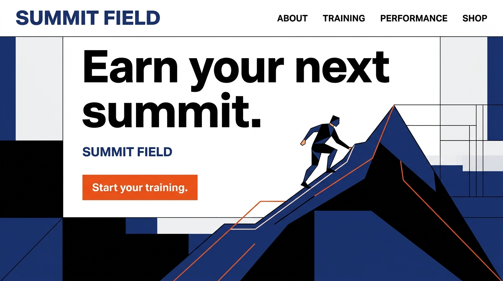

# The Hero
[Back to archetypes](README.md) · [Home](../README.md)

## What is it?

The Hero is an archetype organized around courage, strength, and mastery. In Margaret Mark and Carol S. Pearson’s brand-archetype framework, the Hero seeks to prove worth through difficult action and to improve the world through skill and resolve. A Hero brand promises that effort can meet a real challenge; it should show the work behind its confidence rather than rely on empty bravado.

## How do you recognize or use it?

Use active verbs, clear goals, visible progress, and evidence of competence. Strong contrasts and purposeful compositions can make a challenge feel urgent, while a specific next step gives the audience a way to begin. The archetype fits training, safety, performance, and advocacy when the brand can support its promise. Its shadow is aggression or shaming people who cannot meet an unrealistic standard.

## Examples

The paired concepts use one fictional fitness offer, **SUMMIT FIELD**, so the style changes while the promise stays consistent. The illustrations and offer are original static SVG mockups, not photographs, customer evidence, or tested conversion designs.

### Example 1 — Modernist

Archetype: Hero. Style: [Swiss Style](../modernism/swiss-style.md). Persuasion: commitment and consistency, expressed through training toward a chosen goal. Headline: “Earn your next summit.” CTA: “Start your training.” The strict grid, restrained color, and direct promise frame mastery as a disciplined process; the mountain illustration makes the challenge legible without claiming results.

### Example 2 — Postmodernist

Archetype: Hero. Style: [Memphis Group](../postmodernism/memphis-group.md). Persuasion: commitment and consistency, expressed through a concrete first training step. Headline: “Earn your next summit.” CTA: “Start your training.” Bright color and irregular shapes make the climb feel energetic, while the same specific action preserves the Hero’s emphasis on effort and capability.

## Sources

- Margaret Mark and Carol S. Pearson, *The Hero and the Outlaw: Building Extraordinary Brands Through the Power of Archetypes* (McGraw-Hill, 2001).
- [Cialdini’s principles of persuasion](https://www.influenceatwork.com/7-principles-of-persuasion/) — framework referenced for the example’s commitment-related approach.
- Static SVG concepts and copy created for this project; no external imagery used.
