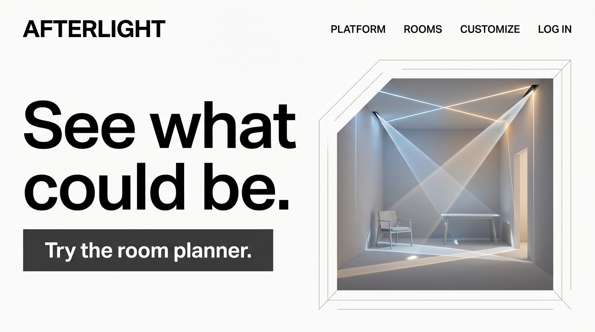
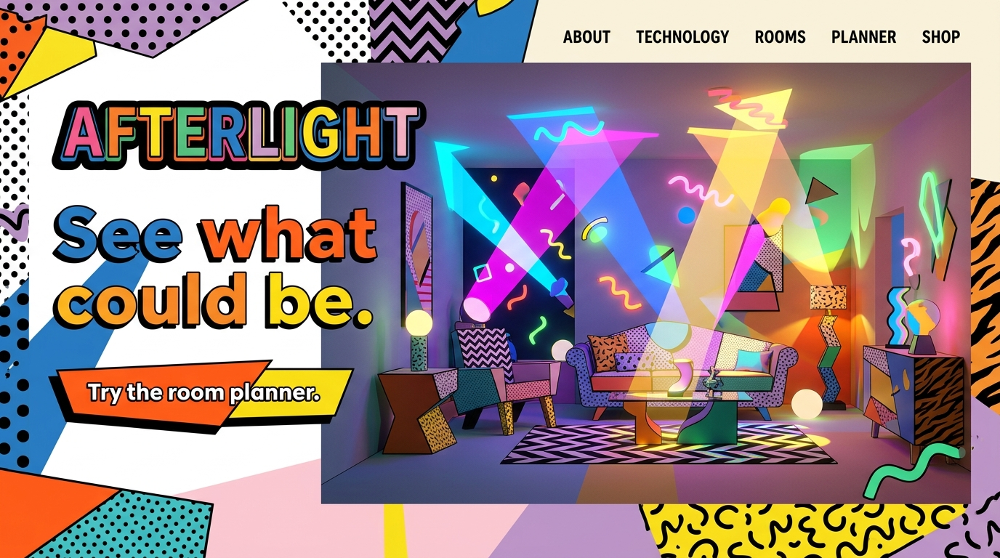

# The Magician
[Back to archetypes](README.md) · [Home](../README.md)

## What is it?

The Magician promises transformation: a shift from an ordinary or difficult state to a more possible one. Wonder and imagination are central, but so is a sense that the change can happen. In Mark and Pearson’s framework, Magician brands make a vision feel attainable by connecting insight, technology, or ritual with a meaningful result.

## How do you recognize or use it?

Use vivid before-and-after ideas, evocative imagery, and language that invites discovery. Pair the sense of wonder with a clear account of what the product actually does. The archetype can suit creative tools, learning, wellness, and technologies that help people see or do something differently. Its risk is overpromising a miraculous transformation or obscuring the mechanism behind it.

## Examples

The paired concepts use one fictional room-lighting planner, **AFTERLIGHT**. The illustrations and offer are original static SVG mockups; the room-scan capability is fictional and does not represent a tested product.

### Example 1 — Modernist

Archetype: Magician. Style: [Swiss Style](../modernism/swiss-style.md). Persuasion: reciprocity, through a low-friction preview of a useful possibility. Headline: “See what could be.” CTA: “Try the room planner.” The precise grid gives the abstract light transformation a practical frame; a clear action links the imaginative promise to a concrete preview.

### Example 2 — Postmodernist

Archetype: Magician. Style: [Memphis Group](../postmodernism/memphis-group.md). Persuasion: reciprocity, suggesting an exploratory preview before a larger commitment. Headline: “See what could be.” CTA: “Try the room planner.” Playful geometry makes transformation feel surprising and accessible, while the CTA keeps the promise attached to an understandable tool.

## Sources

- Margaret Mark and Carol S. Pearson, *The Hero and the Outlaw: Building Extraordinary Brands Through the Power of Archetypes* (McGraw-Hill, 2001).
- [Cialdini’s principles of persuasion](https://www.influenceatwork.com/7-principles-of-persuasion/) — reciprocity is the supporting mechanism in the examples.
- Static SVG concepts and copy created for this project; no external imagery used.
