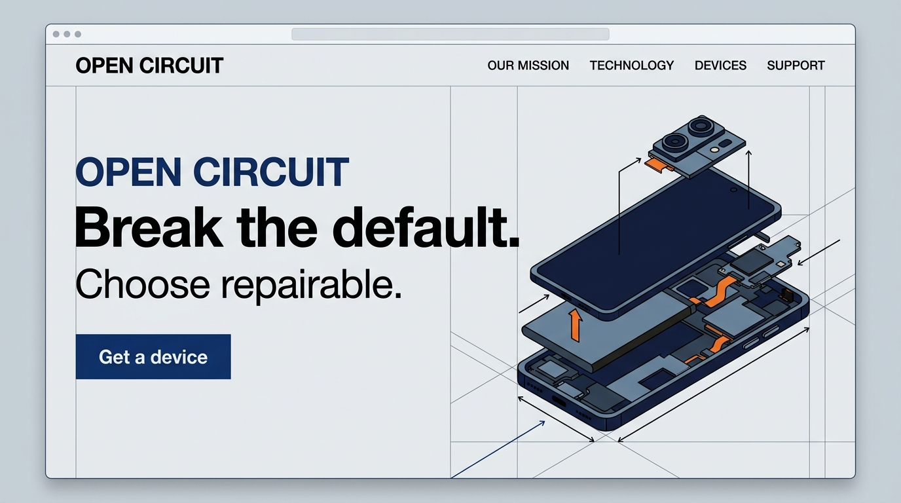
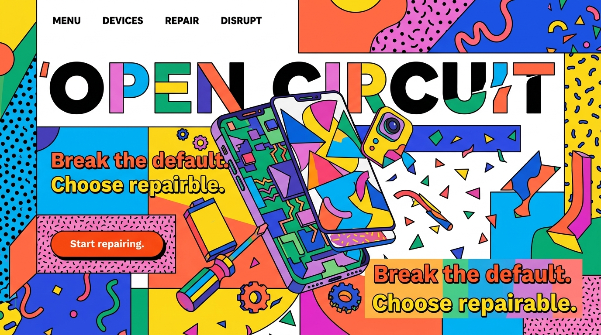

# The Outlaw (Rebel)
[Back to archetypes](README.md) · [Home](../README.md)

## What is it?

The Outlaw, also called the Rebel, challenges rules and systems it sees as limiting or unjust. Mark and Pearson describe the archetype through rebellion, disruption, and breaking rules: its promise is change, and its appeal is the freedom to reject an unsatisfying status quo. For a brand, rebellion needs a target and a credible alternative or it becomes styling without substance.

## How do you recognize or use it?

Recognize it through provocative language, visible contrast, unexpected combinations, and a clear point of view. It suits products or movements that make an established practice easier to question or replace. Show what is being challenged and how the offer helps; avoid glamorizing harm or treating every convention as oppressive. A rebellious tone can invite people in, but can also alienate audiences who do not share the diagnosis.

## Examples

The paired concepts use one fictional repairable phone offer, **OPEN CIRCUIT**. The SVG artwork and claims are original teaching mockups; “designed to be opened” is part of the fictional brief, not a real product claim or customer evidence.

### Example 1 — Modernist

Archetype: Outlaw. Style: [Swiss Style](../modernism/swiss-style.md). Persuasion: commitment and consistency, inviting people to act in line with a preference for repair. Headline: “Break the default.” CTA: “Choose repairable.” A disciplined grid gives the argument clarity, while the disassembled phone symbol makes the alternative to a disposable upgrade cycle concrete.

### Example 2 — Postmodernist

Archetype: Outlaw. Style: [Memphis Group](../postmodernism/memphis-group.md). Persuasion: commitment and consistency, framed as a choice against the default. Headline: “Break the default.” CTA: “Choose repairable.” The unruly color and tilted panel give the message a disruptive voice; the same product and action keep the design tied to a practical alternative rather than rebellion alone.

## Sources

- Margaret Mark and Carol S. Pearson, *The Hero and the Outlaw: Building Extraordinary Brands Through the Power of Archetypes* (McGraw-Hill, 2001).
- [Cialdini’s principles of persuasion](https://www.influenceatwork.com/7-principles-of-persuasion/) — framework referenced for commitment and consistency.
- Static SVG concepts and copy created for this project; no external imagery used.
